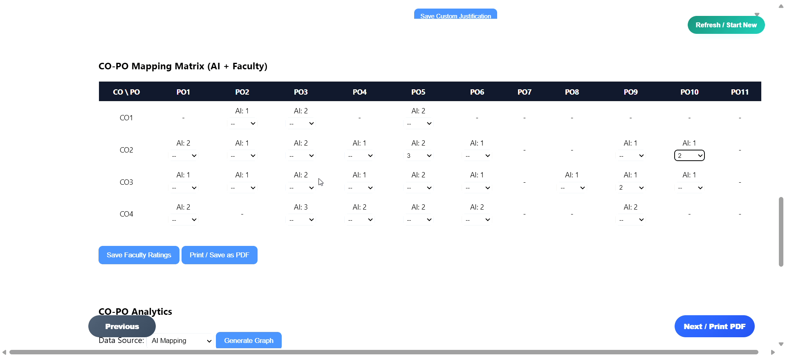
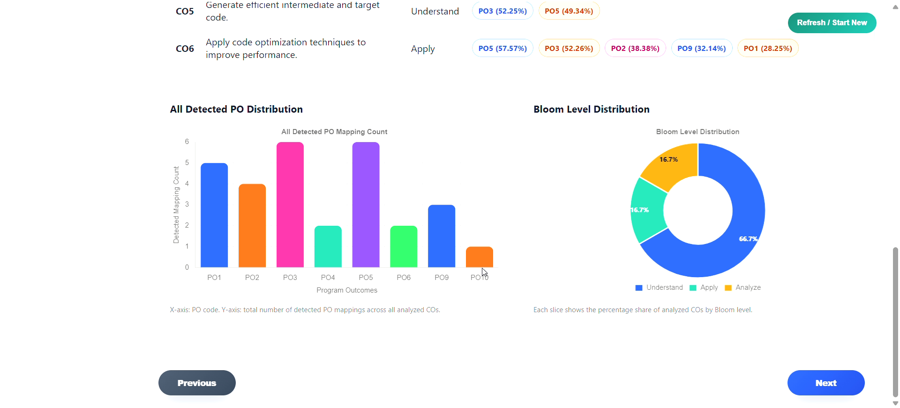
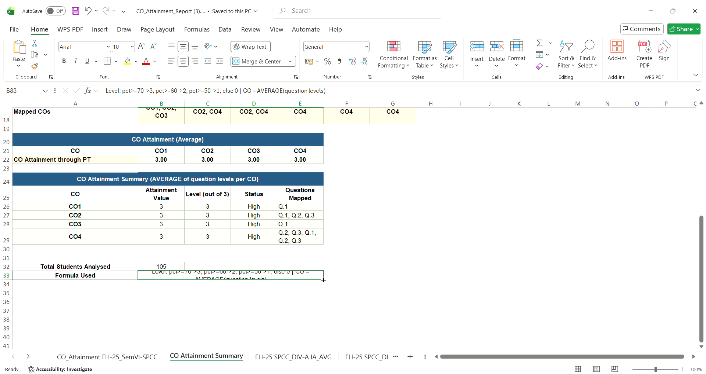
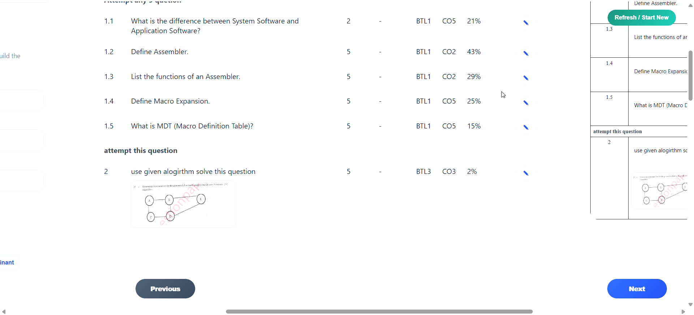

# AI-Powered CO-PO Mapping System

An intelligent, natural language processing (NLP) driven platform to automate and optimize the mapping of **Course Outcomes (COs)** to **Program Outcomes (POs)**, aligning with modern educational frameworks like NAAC and NBA.

---

## 🚀 Project Overview

In outcome-based education (OBE), mapping Course Outcomes (what students learn in a course) to Program Outcomes (what students should achieve by graduation) is a vital but highly manual, subjective, and time-consuming task for educators. 

This project solves this challenge by providing a web-based portal where instructors can input/upload course materials, syllabus details, exam questions, and course outcomes. The system automatically calculates mapping strengths (from 0 to 3) and categorizes cognitive difficulty using a **Hybrid NLP and Cognitive Alignment Engine**.

---

## 🛠️ Tech Stack

### Frontend
- **Core Framework**: React (v19.2.3)
- **HTTP Client**: Axios (for seamless asynchronous backend communication)
- **Styling**: Modern, responsive Custom Vanilla CSS

### Backend
- **Framework**: FastAPI (high-performance Python web server)
- **Server Runner**: Uvicorn
- **Database**: MongoDB (NoSQL database for flexible data structure storing user profiles, COs, POs, and mapping history)
- **Security & Config**: 
  - `bcrypt` (Secure cryptographic password hashing)
  - `python-dotenv` (Separation of code and secrets via environment variables)

### Artificial Intelligence & NLP Engine
- **TF-IDF (Scikit-Learn)**: Term Frequency-Inverse Document Frequency vectorizer for keyword match overlap (20% weight).
- **Universal Sentence Encoder (USE via TensorFlow Hub)**: Pre-trained sentence embeddings for broad semantic context representation (30% weight).
- **BERT (Sentence-Transformers)**: Deep, bi-directional context embeddings for advanced semantic similarity analysis (50% weight).
- **Bloom's Taxonomy Parser**: Regex-based keyword and active verb analyzer to identify cognitive levels (Remember, Understand, Apply, Analyze, Evaluate, Create).
- **OCR Engine (EasyOCR)**: Optical Character Recognition to extract text from scanned documents or PDFs.

---

## 🧠 The Hybrid AI Scoring Approach

To achieve maximum accuracy and robustness, the mapping system employs a multi-layered hybrid NLP algorithm:

```
                  ┌──────────────────────┐
                  │ Input CO / Question │
                  └──────────┬───────────┘
                             ▼
     ┌───────────────────────┼───────────────────────┐
     │                       │                       │
     ▼                       ▼                       ▼
┌──────────┐            ┌──────────┐            ┌──────────┐
│  TF-IDF  │            │   USE    │            │   BERT   │
│ Similarity │          │ Similarity │          │ Similarity │
│  [ 20% ] │            │  [ 30% ] │            │  [ 50% ] │
└────┬─────┘            └────┬─────┘            └────┬─────┘
     │                       │                       │
     └───────────────────────┼───────────────────────┘
                             ▼
                 ┌───────────────────────┐
                 │  Weighted Hybrid Score│
                 └───────────┬───────────┘
                             │ (Adjusted by Bloom's cognitive alignment)
                             ▼
                 ┌───────────────────────┐
                 │ Mapping Level (0 - 3) │
                 └───────────────────────┘
```

1. **TF-IDF Similarity (Weight: 20%)**: Computes exact term overlap and keyword relevance between CO and PO descriptions.
2. **USE Similarity (Weight: 30%)**: Generates semantic embeddings of text to detect similar concepts even when phrased differently.
3. **BERT Similarity (Weight: 50%)**: Captures deep contextual semantics of words in the sentence context, providing the highest accuracy weight.
4. **Bloom's Taxonomy Classification**: Analyzes exam questions and COs for leading action verbs (e.g., *design*, *evaluate*, *define*). It maps them to the 6 cognitive domains (Remembering, Understanding, Applying, Analyzing, Evaluating, Creating) to compute a cognitive alignment score.

### Mapping Strength Scale
The final score determines the mapping level:
- **Level 0 (No Mapping)**: Score < `0.40`
- **Level 1 (Low Mapping)**: Score `0.40` - `0.60`
- **Level 2 (Medium Mapping)**: Score `0.60` - `0.75`
- **Level 3 (High Mapping)**: Score >= `0.75`


## 📸 Screenshots

**Faculty Login / Signup**


**CO–PO Mapping Dashboard — Course Setup**


**AI + Faculty CO–PO Mapping Matrix**


**Analytics — PO Distribution & Bloom Level Breakdown**


**Auto-Generated CO Attainment Report (Excel Export)**


**Question → CO Detection with Bloom's Taxonomy Level (BTL)**


## ⚙️ Setup & Installation

### Prerequisites
- Python 3.10+ 
- Node.js 18+
- A MongoDB instance (local, or a free [MongoDB Atlas](https://www.mongodb.com/cloud/atlas) cluster)

### 1. Clone the repo
```bash
git clone https://github.com/<your-username>/AI_NLP_CO-PO_MAPPER.git
cd AI_NLP_CO-PO_MAPPER
```

### 2. Backend setup
```bash
cd backend
python -m venv venv
venv\Scripts\activate      # Windows
source venv/bin/activate   # macOS/Linux

pip install -r requirements.txt

# Create a .env file in backend/ based on .env.example
# MONGODB_URI=your_mongodb_connection_string

uvicorn main:app --reload --port 9000
```

### 3. Frontend setup
```bash
cd frontend/frontend-app
npm install
npm start
```

The frontend runs on `http://localhost:3000` and expects the backend at `http://127.0.0.1:9000` by default (configurable via `window.API_BASE_URL` in `public/index.html`).

## 🌐 Deployment

| Layer | Suggested free host |
|---|---|
| Frontend | [Vercel](https://vercel.com) or [Netlify](https://netlify.com) |
| Backend | [Hugging Face Spaces](https://huggingface.co/spaces) (Docker SDK — handles the TensorFlow/BERT/EasyOCR memory footprint better than most free tiers) |
| Database | [MongoDB Atlas](https://www.mongodb.com/cloud/atlas) free M0 cluster |

👥 Project Team

This project was developed as a group project.

Add your team members here:

Member 1 — Gaurav Anil Zambare
Member 2 — Pankaj Kamlesh Gehlot
Member 3 — Hemanshu Sushilkumar Raut
Member 4 — Priyanka Pravin Solse
## 🎥 Project Demonstration

A complete demonstration of the AI-Based NLP Framework for Automatic CO–PO Mapping is available below.

[▶️ Watch the Project Demo on YouTube](https://youtu.be/TkRLPjiqzr8)


## 🚀 Live Demo

[🌐 Open Live Application](https://ai-nlp-co-po-mapper-frontend.onrender.com)

## 🎥 Project Demo

[▶️ Watch Project Demo on YouTube](https://youtu.be/TkRLPjiqzr8)
## 📝 License & Academic Policy

### License
This project is licensed under the terms of the **Creative Commons Attribution-NonCommercial-NoDerivatives 4.0 International (CC BY-NC-ND 4.0)** license. See the [LICENSE](./LICENSE) file for complete details.

### Academic Integrity Notice
> [!WARNING]
> **Academic Use Only:** This codebase is shared strictly for educational, research, and self-study purposes. Re-submitting this project (in whole or in part) as university coursework, major project submissions, or commercial work violates academic integrity codes. Feel free to fork, reference, and learn from it, but maintain honesty in your submissions!
